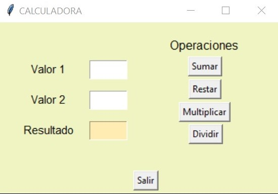

# Proyecto-Final-de-Python

Calculadora Básica
==================

### Operaciones Aritméticas

- Suma;
- Resta;
- Multiplicación;
- División;

> Calculadora por Consola

> Calculadora por Interfaz Gráfica

